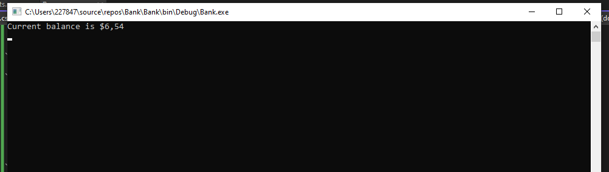
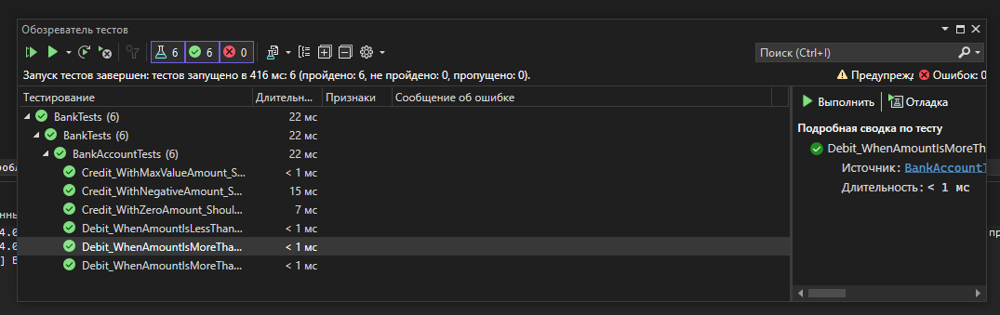

# Практическая работа №6 Создание автоматизированных Unit-тестов (Часть 1)

#### Cкриншот результата работы приложения:

#### Cкриншот окна «Обозреватель тестов»:

#### Вывод: 
Все тесты для класса `BankAccount` успешно пройдены. Это указывает на то, что методы `Debit` и `Credit` функционируют должным образом, корректно обрабатывая некорректный ввод (отрицательные суммы, превышение баланса), выбрасывая исключения `ArgumentOutOfRangeException`, и управляя допустимыми операциями без ошибок (кредит на ноль, большие суммы кредита).
